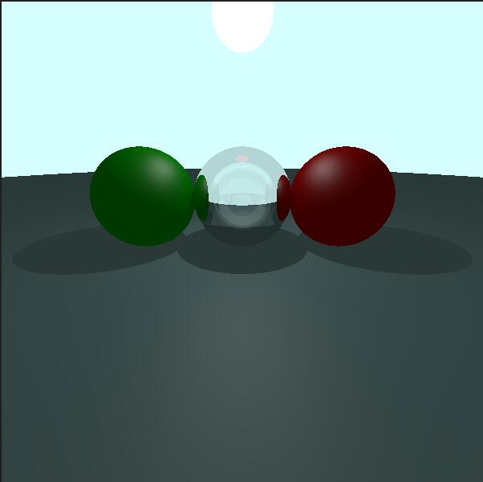

# Lab3 Simple Ray-Tracing

## Basic Knowledge

### The Concept of Ray Tracing

Ray Tracing is a method for rendering the scene, which is inherently different from the rasterization. 

To get the end, the latter rasterize the primitive to fragement, while the former project a ray to the pixel need draw from the camera. So if we could get the color of ray, we could get that of the pixel on the screen.

In fact, this is a demonstration of the phenomenon that the optical path is reversible. That is, light generated from the emitter through various refraction and reflection into the camera can be equivalently seen as light projecting from the camera and eventually reaching the emitter.

### Whitted Style Ray Tracing (Lab Requested)

There are a kinds of algorithms used to compute the color under the general concept of Ray-Tracing. Seeking for simplicity and basis, we would like you to realize the **Whitted Style Ray Tracing**.

* Firstly, you are supposed to find the intersection of the eye ray and the objects in scene, which depicts **what the eye ray sees**.

    As shown in the figure below, the nearest intersection is what we truly need.

    

* Secondly, after getting the intersection, we need to get "the color of ray" by **shading**. In order to simplify the realizing process, we choose **Phong Shading**. Actually, any local shading method could be user here.

    Note that **shadow** should be taken into consideration within the process of shading. Unlike shadow mapping in rasterization, shadow determination in ray tracing is much easier, i.e. it is only necessary to determine **whether the line between the current shading point and the light source intersects with other objects**.

    

* The steps above is sufficient for the objects whose material type is diffusing. However, for some transparent materials like glass, you are supposed to solve the **refraction** and **reflection** further.
    
    In this lab, we assume that **one reflection ray and one refraction ray** will be generated after the intersection of the source ray and glass materials. Addition, we assume that these two generated rays are strictly in accordance with the law of reflection and the law of refraction respectively.

    there is a ratio affecting the contribution of reflection ray or refraction ray to the final color. For the former, the attribute is `reflect_atten`, while that of the latter is `refract_atten` and where these attributes exists in is `Renderer::trace`.
    

## Mission Outline

In this lab, you are supposed to do:

* realize the **Render::trace** function in **Render.cpp**

    trace function is used to compute the final color after the intersection of the ray and the scene.

    trace function used Phong/Blinn-Phong model to realize the shading process.

    you are supposed to realize the algorithm for three different materials(Glass Diffuse Light). The matial information is saved in `rec.mat_ptr`.

The final result should be in match with following figure.

## Code Framework

This framework provides a simple ray-tracing renderer for rendering sphere. We set three material types, which are diffuse, glass and light. the last one means that the object is a light source.

The renderer saves the result in ./output.ppm. If you can not open it with your image-opening software, you are supposed to ask for VSCODE extension.

* Renderer

    used to draw and save the scene
* Ray

    the class of Ray
* Scene

    Scenes to be rendered, covering the objects, light and camera. If you want to add more light source, please call the api in addLight.
* hittable

    the objects in scene. In this framework, we only realize the Sphere class.

    `hit_record` saves the record of the intersection of ray, containing the information of distance, intersection, material and so on.

    `hit` function in Sphere class returns whether intersects and save the intersection record into the parameter `rec`.

* Material

    A structure, covering the member of material type(`type`), diffusion color(`albedo`) and refraction ratio(`refraction_ratio`).

    if material type equals to diffuse or glass, the `refraction_ratio` is invalid.

    if material type equals to glass, the `albedo` is invalid.

* alise

    Aliases.

## Submission

You should submit your **code** along with **a report**.

Please **describe your algorithm** in your report.

Please submit on canvas before deadline.

Pack your program so that it can run on **BARE computers**, which means you should provide glfw \& glad & glm environment and .sln or CMakeLists files.

In this lab, windows users may not bother to provide the environment. But this **should be a must** for linux/macos users.

Providing an executable is strongly recommended.

**Plagiarism will not be tolerated.**