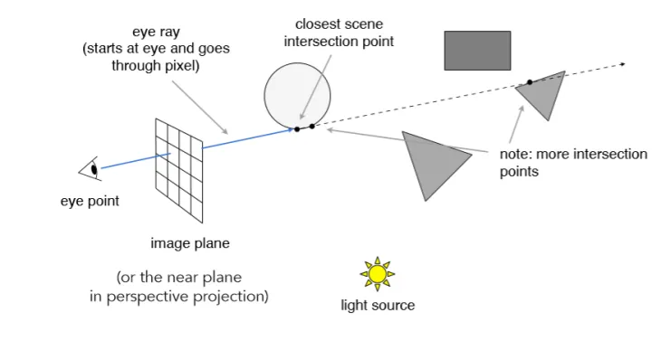
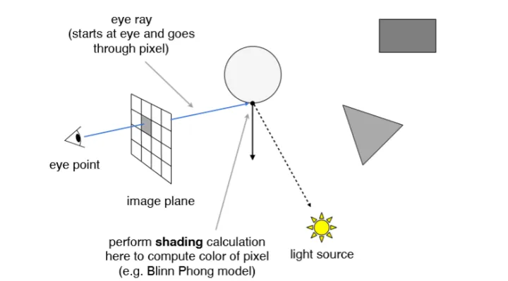
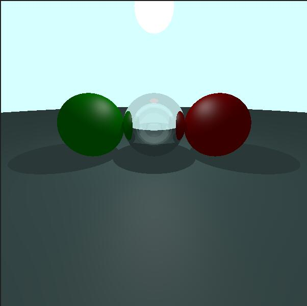

# Lab3 Instructions

## 基础知识

### 光线追踪的思想

光线追踪 (Ray Tracing) 是一种渲染场景的方法，其渲染思路与光栅化有本质上的不同。

光栅化渲染是针对每一个物体进行的，渲染器将物体上的面元光栅化为片元（像素），从而达成绘制的目的。

而光线追踪的思路是，渲染屏幕上的一个像素时，我们从相机出发，指向这个需要绘制的像素，投射出一条光线，如果能够得到这条光线的颜色，那么我们就能得到屏幕上这个像素点的颜色。

事实上，这是光路可逆现象的一种体现，即发光体通过各种反射进入摄像机的光线，可以等价地认为是一条从摄像机出发，最终到达发光体的光线。

### Whitted Style Ray Tracing (本次 Lab)

在光线追踪这个总体的概念下，存在多种具体计算颜色的算法，本次 Lab 要求你实现 Whitted Style Ray Tracing. 这是一种相对简单和基础的光追算法。

* 算法的第一步，我们需要找到这条射线(eye ray)与场景中物体的交点，即这条射线能够“看到”的物体。

    如下图所示，与场景中物体求交时，最近的交点才是我们真正需要的

    

* 第二步，得到交点后，我们需要对交点进行**着色** (shading)，得到“光线的颜色”。为了简单起见，本次 Lab 中使用的就是简单的 Phong Shading。事实上，任何 local shading 方式都可以用在此处。

    注意，着色的时候需要额外考虑**阴影**。与光栅化中的shadow mapping 思路不同，光线追踪中的阴影判断更为简单，即只需要判断 *当前着色点与光源的连线是否与其他物体相交*。

    

* 以上两步对于漫反射物体的着色已经足够，但是对于玻璃等透明材质，则需要进一步考虑光线的**反射**和**透射**（折射）。在本次实验中，我们假设光线与玻璃材质相交后，会产生一条透射光线和一条反射光线。这两条光线的方向分别严格符合反射定律和折射定律。

    需要注意的是，反射光和折射光对最终颜色的贡献存在一个比例，这个比例在 `Renderer::trace` 中给出，分别为 `reflect_atten` 和 `refract_atten`。

    

## 任务介绍

在本次 lab 中，你需要完成：

* 完成 Render.cpp 中 Renderer::trace 函数的实现

    trace 函数计算光线 ray 与场景 scene 求交后的颜色，并返回之。
    
    trace 函数中使用 Phong/Blin-Phong shading 对物体进行着色。
    
    你需要对三种材质 Glass, Diffuse, Light 完成不同的着色算法。材质信息保存在 rec.mat_ptr 中。

我们提供了拥有四个球体和一个光源的测试场景，如果你需要修改场景进行测试，可以修改 main.cpp 中的对应内容。

最终效果应该与下图类似

## 代码框架

该代码提供了一个简单光线追踪渲染器，仅支持球体的渲染，diffuse、glass 和 light 三种材质，其中 light 材质表示该物体是一个发光源。

渲染器将渲染结果保存在 ./output.ppm 文件中。ppm 文件是一种简单的图片格式，使用字符串类型存储像素值，如果你的图片打开器不支持该格式，可以使用 vscode 相关扩展。

* Renderer
    用于绘制场景，保存场景
* Ray
    射线类
* Scene
    待渲染场景，包含了 Objects，light 和 camera，如果你要添加光源，请调用 addLight 的api。
* hittable
    场景物体，该代码框架中仅实现了 Sphere 类。

    hit_record 为光线求交的记录，保留了距离，交点，所交物体和交点材质等多种信息。

    Sphere 类中 hit 函数返回值为是否相交，并将求交记录保存在参数 rec 中。

* Material

    本质为一个结构体，有材质类型(type), 漫反射颜色(albedo)，反射率(refraction_ratio)三个结构体成员。

    如果类型为 diffuse 和 glass, 则反射率为无效参数
    如果类型为 glass, 则albedo 为无效参数

* alise

    别名。color 为 vec3 的别名。

## 提交

You should submit your **code** along with **a report**.

Please **describe your algorithm** in your report.

Please submit on canvas before deadline.

Pack your program so that it can run on **BARE computers**, which means you should provide glfw \& glad & glm environment and .sln or CMakeLists files.

In this lab, windows users may not bother to provide the environment. But this **should be a must** for linux/macos users.

Providing an executable is strongly recommended.

**Plagiarism will not be tolerated.**